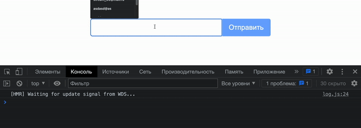

Форма подписки
===

## Подготовка

Для начала тебе нужно изучить как работать с формами в React:
 - https://ru.reactjs.org/docs/forms.html - официальная документация
 - https://youtu.be/hkd2oVOqzQs - видео по теме
 - https://youtu.be/f4VQOhikMIo - еще одно видео
 - https://youtu.be/WADswtZB-qg - пример простой валидации

## Задача

Необходимо реализовать форму подписки со встроенной валидацией.

## Описание компонента

* Если форма ввода (input) остается пустой после того как была выбрана, она получает класс `is-error`, и пользователю показывается сообщение с текстом
  `Поле ввода не должно быть пустым`. Класс `is-error` должен быть оформлен таким образом, чтобы форма ввода подсвечивалась красным цветом.
* Если форма пустая, кнопка отправки не должна быть активной;
* При вводе текста в форму, кнопка становится активной, а сообщение и класс `is-error` пропадают;
* При клике на кнопку, должно появиться сообщение `Сообщение успешно отправлено`, а сам введенный текст должен быть выведен в консоль;

Готовое решение выгрузи на `github`.

